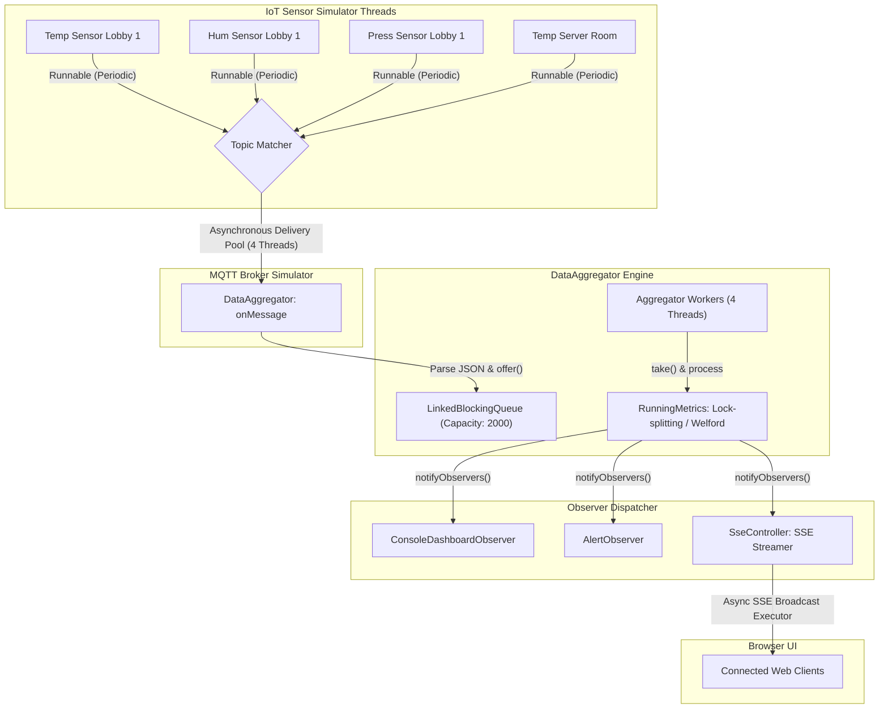

# Real-time IoT Sensor Data Aggregator

A high-performance, concurrent J2SE telemetry engine and Spring Boot web dashboard that simulates real-time data ingestion from multiple distributed IoT sensors, aggregates statistical metrics (averages, min/max bounds, standard deviations) under thread-safe locking conditions, and broadcasts live updates to client browsers.

**🌐 Live Production Link:** [https://real-time-iot-aggregator.onrender.com/](https://real-time-iot-aggregator.onrender.com/)

---

## 📐 System Architecture

Below is the event-driven data flow of the application. The system decouples telemetry publishers (sensors) from consumers (dashboard/alerts) using an in-memory broker, a bounded queue buffer, worker pools, and the Observer pattern.



---

## 🔒 Advanced Concurrency & Design Decisions

### 1. Bounded Producer-Consumer Pattern
The `DataAggregator` ingests raw JSON streams from the broker and enqueues them into a bounded `LinkedBlockingQueue` with a maximum capacity of `2,000` elements:
```java
// Bounded queue prevents Memory Leakage / OutOfMemoryError under input spikes
private final BlockingQueue<TelemetryPacket> ingestionQueue = new LinkedBlockingQueue<>(2000);
```
**Rationale:** In high-frequency IoT environments (such as smart buildings with thousands of nodes), a sudden network flush can cause a thread spike. The bounded queue acts as a buffer. If the processing threads fall behind, the queue blocks or drops incoming packets gracefully rather than growing boundlessly and triggering an `OutOfMemoryError`.

---

### 2. Lock-Splitting with `ReentrantReadWriteLock`
To track aggregates (mean, min, max, variance) for each sensor, we avoid heavy global synchronization. We isolate lock scopes to individual sensors via the `RunningMetrics` class, which employs lock-splitting:
```java
public class RunningMetrics {
    private final ReentrantReadWriteLock rwLock = new ReentrantReadWriteLock();
    private final ReadLock readLock = rwLock.readLock();
    private final WriteLock writeLock = rwLock.writeLock();

    public void update(double value, long timestamp) {
        writeLock.lock(); // Exclusive access for recalculations
        try {
            // Recalculate mean, min, max, variance
        } finally {
            writeLock.unlock();
        }
    }

    public MetricSnapshot getSnapshot() {
        readLock.lock(); // Shared access for queries
        try {
            return new MetricSnapshot(...);
        } finally {
            readLock.unlock();
        }
    }
}
```
**Rationale:** A `synchronized` block blocks all reading operations when any other thread is reading. In our system, writes (updating metrics) occur periodically, but reads (REST API queries, log rendering, and SSE dashboard streaming) occur heavily. The `ReentrantReadWriteLock` allows hundreds of concurrent clients to read aggregates without thread contention, only blocking when a worker thread is writing an update.

---

### 3. Online Numerical Aggregation (Welford's Algorithm)
Computing standard deviation and variance normally requires storing every single value in a list, which results in $O(N)$ space complexity and floating-point rounding errors. We implement **Welford's algorithm** to compute running variance in $O(1)$ space:
```java
// Welford's Online Variance Calculation (RunningMetrics.java)
count++;
if (count == 1) {
    min = value;
    max = value;
    mean = value;
    m2 = 0.0;
} else {
    min = Math.min(min, value);
    max = Math.max(max, value);
    double oldMean = mean;
    mean += (value - oldMean) / count;
    m2 += (value - oldMean) * (value - mean); // Accumulate sum of squares of differences
}
```
**Rationale:** Keeps the application memory footprint constantly low, irrespective of how long the application runs (hours, days, or months).

---

### 4. Asynchronous Thread-Isolated SSE Broadcasting
In `SseController`, we stream live data updates to web clients using Server-Sent Events (SSE). To protect the core thread pool, client dispatch is isolated:
```java
// Dedicated single-threaded executor for outbound network writes
private final ExecutorService sseExecutor = Executors.newSingleThreadExecutor(r -> {
    Thread t = new Thread(r, "sse-broadcast-worker");
    t.setDaemon(true);
    return t;
});
```
**Rationale:** If a browser client experiences high latency or drops their network connection, writing to that client's HTTP socket will block. If the J2SE core aggregator threads were directly performing this write, the entire processing pipeline would freeze. Offloading writes to a dedicated `sseExecutor` isolates the core engine.

---

## 🗂️ Project Directory File Guide

| Package / File | Type | Responsibility |
|---|---|---|
| **`com.iotaggregator`** | | |
| ├── [App.java](file:///c:/Users/SJ/Documents/Real-time%20IoT%20Sensor%20Data%20Aggregator/src/main/java/com/iotaggregator/App.java) | Class | Boots Spring Boot web container and launches the system. |
| **`com.iotaggregator.core.model`** | | |
| ├── [SensorType.java](file:///c:/Users/SJ/Documents/Real-time%20IoT%20Sensor%20Data%20Aggregator/src/main/java/com/iotaggregator/core/model/SensorType.java) | Enum | Defines sensor metadata (units, baselines, alarm thresholds). |
| ├── [TelemetryPacket.java](file:///c:/Users/SJ/Documents/Real-time%20IoT%20Sensor%20Data%20Aggregator/src/main/java/com/iotaggregator/core/model/TelemetryPacket.java) | Class | Immutable value object carrying a single sensor reading. |
| ├── [MetricSnapshot.java](file:///c:/Users/SJ/Documents/Real-time%20IoT%20Sensor%20Data%20Aggregator/src/main/java/com/iotaggregator/core/model/MetricSnapshot.java) | Class | Immutable snapshot of computed running statistics. |
| **`com.iotaggregator.core.broker`** | | |
| ├── [MqttSubscriber.java](file:///c:/Users/SJ/Documents/Real-time%20IoT%20Sensor%20Data%20Aggregator/src/main/java/com/iotaggregator/core/broker/MqttSubscriber.java) | Interface | Functional callback interface for pub-sub topics. |
| ├── [MqttBrokerSimulator.java](file:///c:/Users/SJ/Documents/Real-time%20IoT%20Sensor%20Data%20Aggregator/src/main/java/com/iotaggregator/core/broker/MqttBrokerSimulator.java) | Class | In-memory message router supporting MQTT wildcards (`#`). |
| **`com.iotaggregator.core.aggregator`** | | |
| ├── [RunningMetrics.java](file:///c:/Users/SJ/Documents/Real-time%20IoT%20Sensor%20Data%20Aggregator/src/main/java/com/iotaggregator/core/aggregator/RunningMetrics.java) | Class | Synchronized stats accumulator using ReadWriteLocks. |
| ├── [DataAggregator.java](file:///c:/Users/SJ/Documents/Real-time%20IoT%20Sensor%20Data%20Aggregator/src/main/java/com/iotaggregator/core/aggregator/DataAggregator.java) | Class | Core producer-consumer queue buffer and thread pool manager. |
| **`com.iotaggregator.core.observer`** | | |
| ├── [TelemetryObserver.java](file:///c:/Users/SJ/Documents/Real-time%20IoT%20Sensor%20Data%20Aggregator/src/main/java/com/iotaggregator/core/observer/TelemetryObserver.java) | Interface | Observer contract for decoupled event publishing. |
| ├── [TelemetrySubject.java](file:///c:/Users/SJ/Documents/Real-time%20IoT%20Sensor%20Data%20Aggregator/src/main/java/com/iotaggregator/core/observer/TelemetrySubject.java) | Interface | Subject contract for registering/notifying observers. |
| ├── [ConsoleDashboardObserver.java](file:///c:/Users/SJ/Documents/Real-time%20IoT%20Sensor%20Data%20Aggregator/src/main/java/com/iotaggregator/core/observer/ConsoleDashboardObserver.java) | Class | Writes aggregated summaries directly to stdout. |
| ├── [AlertObserver.java](file:///c:/Users/SJ/Documents/Real-time%20IoT%20Sensor%20Data%20Aggregator/src/main/java/com/iotaggregator/core/observer/AlertObserver.java) | Class | Scans packets and throws alarms if they breach thresholds. |
| **`com.iotaggregator.core.sensor`** | | |
| ├── [SensorSimulator.java](file:///c:/Users/SJ/Documents/Real-time%20IoT%20Sensor%20Data%20Aggregator/src/main/java/com/iotaggregator/core/sensor/SensorSimulator.java) | Class | Simulates a physical sensor thread using sine-wave generation. |
| ├── [SensorFactory.java](file:///c:/Users/SJ/Documents/Real-time%20IoT%20Sensor%20Data%20Aggregator/src/main/java/com/iotaggregator/core/sensor/SensorFactory.java) | Class | Factory utility to instantiate pre-configured sensors. |
| **`com.iotaggregator.cloud`** | | |
| ├── [CloudAggregatorService.java](file:///c:/Users/SJ/Documents/Real-time%20IoT%20Sensor%20Data%20Aggregator/src/main/java/com/iotaggregator/cloud/service/CloudAggregatorService.java) | Class | Spring Service managing thread lifecycles and background loops. |
| ├── [SensorController.java](file:///c:/Users/SJ/Documents/Real-time%20IoT%20Sensor%20Data%20Aggregator/src/main/java/com/iotaggregator/cloud/controller/SensorController.java) | Class | REST API endpoint controller (CRUD on sensors, thresholds). |
| ├── [SseController.java](file:///c:/Users/SJ/Documents/Real-time%20IoT%20Sensor%20Data%20Aggregator/src/main/java/com/iotaggregator/cloud/controller/SseController.java) | Class | Server-Sent Events controller for asynchronous client streaming. |

---

## 📈 API Reference

All APIs are exposed under the `/api` prefix:

- `GET /api/sensors` - Fetch configs of all active simulator threads.
- `POST /api/sensors` - Spawn a new simulator thread dynamically.
  - *Payload example:* `{"sensorId":"temp-roof","sensorType":"TEMPERATURE","baseline":15.0,"fluctuationAmplitude":3.0,"intervalMs":1000}`
- `DELETE /api/sensors/{id}` - Gracefully shut down a specific simulator thread.
- `GET /api/metrics` - Query latest snapshots of all sensor aggregates.
- `GET /api/metrics/{id}` - Query snapshot aggregates for a specific sensor.
- `GET /api/thresholds` - List all active custom alarm thresholds.
- `POST /api/thresholds/{id}?value=X` - Update/set custom alert threshold.
- `DELETE /api/thresholds/{id}` - Delete custom threshold and revert to default.
- `GET /api/live-stream` - Open Server-Sent Events (SSE) stream.

---

## 🧪 Verification & Test Suite

We maintain a rigorous test suite under `src/test/java/com/iotaggregator/core/` to verify structural accuracy, math correctness, and thread safety.

### 1. Concurrency Stress Test (`ConcurrencyTest.java`)
- **`testRunningMetricsThreadSafety`**: Runs **16 threads** writing **16,000 updates** concurrently to a single `RunningMetrics` instance. Uses a `CountDownLatch` to trigger all writing threads simultaneously to force race conditions. Verifies that the final count is exactly 16,000 and the locks kept the calculations 100% accurate.
- **`testDataAggregatorPipelineSafety`**: Starts **8 concurrent producer threads** enqueuing **2,000 packets** in total to verify that the `LinkedBlockingQueue` and the worker pool consumer loop do not drop any telemetry packets.

### 2. Math & Edge Cases (`AggregatorTest.java`)
- **`testWelfordAlgorithmAccuracy`**: Feeds a static series `[10, 12, 23, 23, 16, 23, 21, 16]` and asserts that the calculated mean (18.0) and standard deviation (5.2372) are exactly correct.
- **`testRunningMetricsEdgeCases`**: Verifies that empty sensors and single-value updates compile correctly without dividing by zero.

### 3. Observer Registration (`ObserverPatternTest.java`)
- Verifies that observers can register, receive notifications concurrently, and unregister on-the-fly without throwing concurrent modification exceptions.

---

## 🐳 How to Run Locally

1. **Verify your local JDK is set up (Java 17+ is required).**
2. **Build and package the JAR:**
   ```bash
   mvn clean package
   ```
3. **Execute the test suite:**
   ```bash
   mvn test
   ```
4. **Start the server:**
   ```bash
   mvn spring-boot:run
   ```
5. Open **[http://localhost:8080](http://localhost:8080)** to view the dashboard interface.
